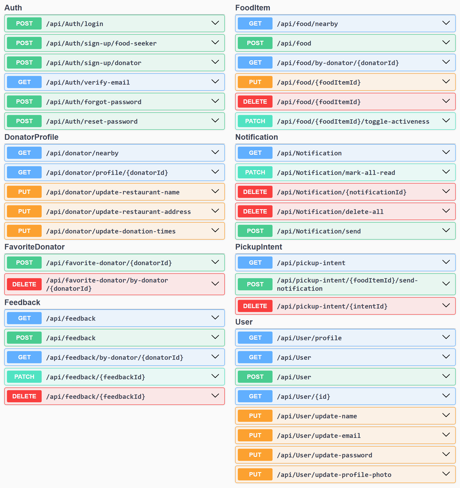
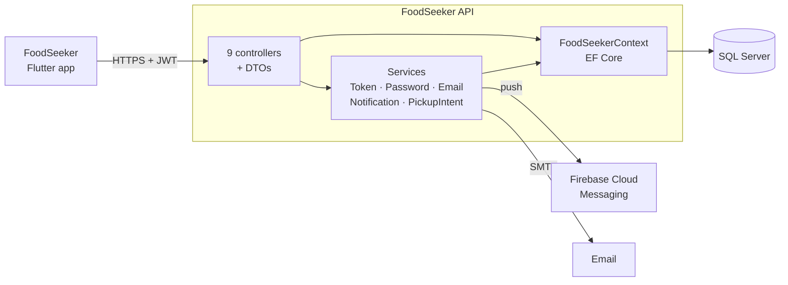
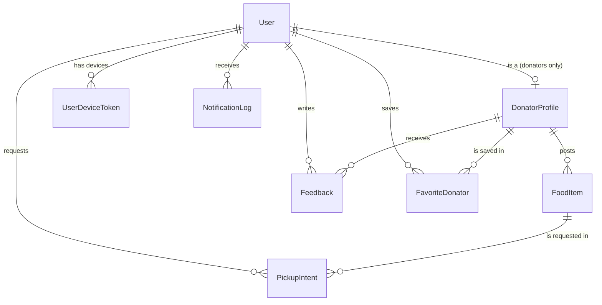

# FoodSeeker API

ASP.NET Core Web API that connects restaurants with surplus food to people nearby who can pick it up. Restaurants post what's left; food seekers search by location, request a pickup, and the restaurant gets a push notification.

> 🎓 Graduation project (2025) · .NET 9 · backend for the [FoodSeeker Flutter app](https://github.com/iulvimercan/FoodSeeker_Flutter)

[](https://github.com/iulvimercan/FoodSeeker_API/actions/workflows/ci.yml)




## ✨ Features
- **Two roles:** donators (restaurants) and food seekers, enforced with role-based JWT authorization (only donators manage food items, only seekers request pickups or leave feedback)
- **Account flow:** sign-up with email verification, login, forgot and reset password by email, BCrypt-hashed passwords
- **Food listings:** donators create, edit, activate/deactivate and delete food items (eat-in, takeaway or bring-your-own-container)
- **Location search:** find restaurants within a radius, and active food items nearby filtered by keyword and pickup type, sorted by distance and paged
- **Pickup requests:** a seeker requests an item and the donator gets a push notification; if the item is edited or removed, everyone who requested it is notified
- **Social features:** star-rating feedback with comments, favorite restaurants, per-user notification inbox with read/unread state

## 🏗️ Architecture

A single ASP.NET Core project. Controllers handle requests and return DTOs. Cross-cutting work sits in services registered through DI: JWT creation and validation, BCrypt hashing, email, push notifications, and pickup-request handling. EF Core with code-first migrations maps the models to SQL Server.

<details>
<summary>Data model</summary>


`DonatorProfile` shares its key with `User` (one-to-one) and stores the restaurant's address, coordinates, donation hours, average rating and favorites count.
</details>

## 🧰 Tech stack
**Backend:** ASP.NET Core 9 Web API, Swagger/OpenAPI · **Data:** Entity Framework Core 9, SQL Server · **Auth:** JWT bearer tokens, BCrypt · **Integrations:** Firebase Admin SDK (Cloud Messaging), SMTP email · **Testing:** xUnit, GitHub Actions

## 🚀 Getting started
**Prerequisites:** .NET 9 SDK, a SQL Server instance, a Firebase project (for push notifications), and an SMTP account (for verification and reset emails).

1. Store the configuration in [user secrets](https://learn.microsoft.com/aspnet/core/security/app-secrets) (nothing sensitive is committed):
   ```bash
   dotnet user-secrets set "ConnectionStrings:DefaultConnection" "Server=localhost;Database=FoodSeeker;Trusted_Connection=True;TrustServerCertificate=True"
   dotnet user-secrets set "Jwt:Key" "<random string, at least 32 characters>"
   dotnet user-secrets set "Jwt:Issuer" "FoodSeekerAPI"
   dotnet user-secrets set "SmtpSettings:Host" "<smtp host>"
   dotnet user-secrets set "SmtpSettings:Port" "587"
   dotnet user-secrets set "SmtpSettings:Username" "<smtp user>"
   dotnet user-secrets set "SmtpSettings:Password" "<smtp password>"
   ```
2. Put your Firebase service account key in the project root as `firebase-service-account.json` (it's gitignored). The API loads it at startup.
3. Create the database (needs the `dotnet-ef` tool: `dotnet tool install --global dotnet-ef`) and run the API:
   ```bash
   dotnet ef database update
   dotnet run --launch-profile http
   ```
4. Open http://localhost:5138/swagger. [`FoodSeekerAPI.http`](FoodSeekerAPI.http) has sample requests for sign-up, login, nearby search and pickup requests.
## 🧪 Tests
```bash
dotnet test
```
22 unit tests cover:
- the Haversine distance and radius helpers
- BCrypt hashing and verification
- JWT generation and validation, including that an email-verification token is rejected by the password-reset check and the other way round

CI runs the build and tests on every push and pull request.

## 💡 Design notes
- **Nearby search in two steps.** The query first narrows candidates with a latitude/longitude bounding box that SQL Server can filter. The API then computes the exact Haversine distance for each remaining item to sort by distance and page the results.
- **Separate token purposes.** Access tokens carry the user ID and role (`Donator` or `FoodSeeker`) and last 6 months. Email-verification and password-reset links use short-lived JWTs (15 minutes) with a `purpose` claim, and each validator accepts only its own purpose.
- **Pickup requests expire after 6 hours**, so the request list starts clean for the next day. A seeker can request a given item only once.
- **Notifications are stored and pushed.** Each notification is written to `NotificationLog` (the in-app inbox) and sent through Firebase Cloud Messaging to a device token the user registered from the app.

<!-- TODO: add a LinkedIn link in a "📬 Contact" section -->

## 📄 License
All rights reserved. The code is shared for viewing and evaluation only. See [LICENSE](LICENSE).
